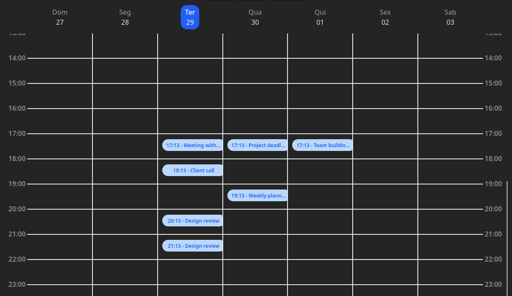

# React Agenda Kit

React components to show scheduled items;

<div style="text-align: center;">
    
## Month


## Week



</div>

---


## Instalation

```
yarn add @jonkasusaki/react-agenda-kit
```

OR

```
npm install @jonkasusaki/react-agenda-kit
```


## Usage

### Define your locale data (optional):
Currently there is just english and portuguese. English is the default


If you want to add your custom locale:
```
// path/to/locale/file.ts

import type { Locale } from '@jonkasusaki/react-agenda-kit'

export const pt: Locale = {
  weekDays: {
    Sunday: "Domingo",
    Monday: "Segunda-feira",
    Tuesday: "Terça-feira",
    Wednesday: "Quarta-feira",
    Thursday: "Quinta-feira",
    Friday: "Sexta-feira",
    Saturday: "Sábado",
  },
  weekDaysShort: {
    Sunday: "Dom",
    Monday: "Seg",
    Tuesday: "Ter",
    Wednesday: "Qua",
    Thursday: "Qui",
    Friday: "Sex",
    Saturday: "Sab",
  },
  months: {
    January: "Janeiro",
    February: "Fevereiro",
    March: "Março",
    April: "Abril",
    May: "Maio",
    June: "Junho",
    July: "Julho",
    August: "Agosto",
    September: "Setembro",
    October: "Outubro",
    November: "Novembro",
    December: "Dezembro",
  },
  monthsShort: {
    January: "Jan",
    February: "Fev",
    March: "Mar",
    April: "Abr",
    May: "Mai",
    June: "Jun",
    July: "Jul",
    August: "Ago",
    September: "Set",
    October: "Out",
    November: "Nov",
    December: "Dez",
  },
};

```


Now on your root component (or anywhere), you define your Locale. This should be set only once.
```
// src/root.tsx

import { setAgendaKitConfig } from '@jonkasusaki/react-agenda-kit'
import { customLocale } from 'path/to/locale/file.ts'


function Root() {

  setAgendaKitConfig({ locale: customLocale })

  return (
    ...
  )
}

```

### Get your items:
```
import type { Item } from '@jonkasusaki/react-agenda-kit'

// Get your items
const exampleItems: Item[] = [
  {
    date: new Date(now.getTime()), // now
    title: "Meeting with team",
  },
  {
    date: new Date(now.getTime() + 1 * 60 * 60 * 1000), // +1 hour
    title: "Client call",
  },
  {
    date: new Date(now.getTime() + 3 * 60 * 60 * 1000), // +3 hours
    title: "Design review",
  },
  {
    date: new Date(now.getTime() + 1 * 24 * 60 * 60 * 1000), // +1 day
    title: "Project deadline",
  },
  {
    date: new Date(now.getTime() + 2 * 24 * 60 * 60 * 1000), // +2 days
    title: "Team building event",
  },
];
```

### Render your components with their items:


```
// Render the component
function MyWeekComponent() {
  // Defined the date to be used for rendering the views
  const [currentDate, setCurrentDate] = useState(new Date())

  return (
    <WeekView currentDate={new Date()} items={exampleItems} />
  )
}

function MyMonthComponent() {
  // Defined the date to be used for rendering the views
  const [currentDate, setCurrentDate] = useState(new Date())

  return (
    <MonthView currentDate={new Date()} items={exampleItems} />
  )
}

```

## About

This library is constantly in development.

If you want to contribute, report bugs or request improvements, access the github link:

https://github.com/JonkaSusaki/react-agenda-kit